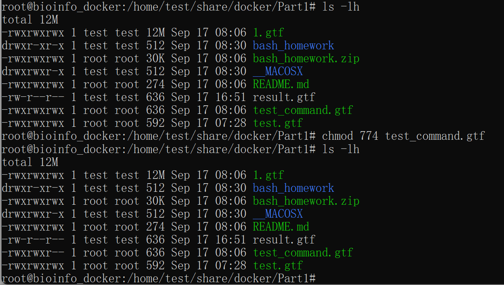
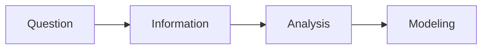

# README

​	This repository is for course **Bioinformatics**, and is aimed at recording the learning process of student *Kitty Yang*.

## Lecture 1

### Notes

#### Basic working flow

1. Question
   - Biological/Medical Knowledge
2. Information
   - Biological /Medical Data
3. Analysis
   - Data Clean & Feature Extraction
4. Modeling
   - Probabilistic Model & Computational Algorithm


<mark>Tips:<mark>

​	Algorithm uses specific codes to get a results, it is about how to actually realize the model.

​	Model is about a logic flow integrated  with physical and biological knowledge or anything else to decide how we want to process and analyze the data.

#### Hypothesis Driven VS. Data Driven



#### What question could bioinformatics address?

*For example:*

- What Is the Biological Basis of Consciousness?

- Why Do Humans Have So Few Genes?

- To What Extent Are Genetic Variation and Personal Health Linked?

Extending working field:

- hot spring
- ocean
- human gut
- ……

#### What do we need to do bioinformatics?

**Tools**:

- Linux
- R
- Python

**Advanced**:

- machine learning, deep learning
- regression model
- Computational Algorithms

#### Markdown learning

$$ y=\frac{\partial y}{\partial x}+x $$

*KittyYang*

```python
print "Hello!"
```

==important==

#Title 1

##Title 2

###title 3

####title 4

……




### Study Plan

​	In general, listening to the teacher's explanation of the theoretical knowledge and general framework of bioinformatics, mainly relying on tutorials to learn the basic skills of bioinformatics, and strive to gradually study supplementary materials during spare time in the holidays.

|                  Personal Development Plan                   |
| :----------------------------------------------------------: |
| Try to understand various codes and commands, rather than mechanically replicating them from tutorials and online resources. |
| Be able to independently write small programs using Python, reducing excessive reliance on ChatGPT. |
|              Learn the R programming language.               |
| Use newly acquired knowledge to rethink existing biological foundations, identify small questions with research potential, and attempt to solve them. |


### Homework

[how to use git](https://github.com/Yjy20050126/Bioinformatics-KittyYang/blob/main/How to use Git/How to use Git.md)
